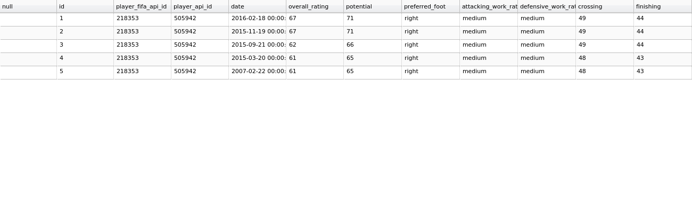
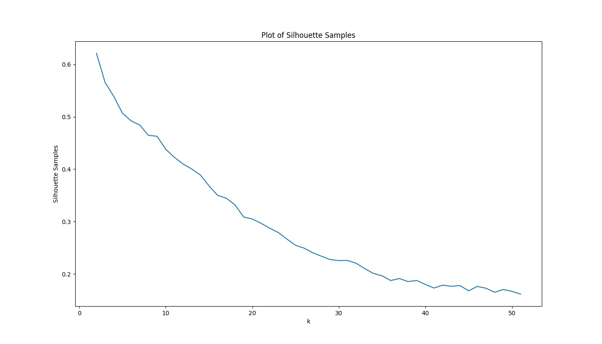
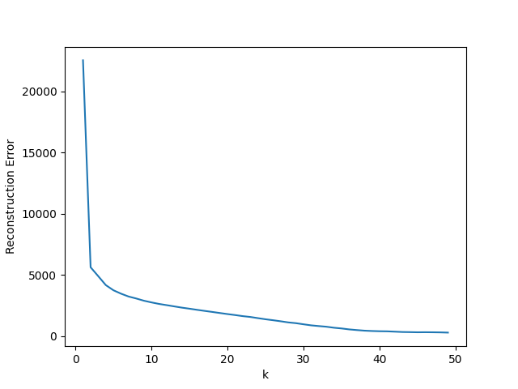
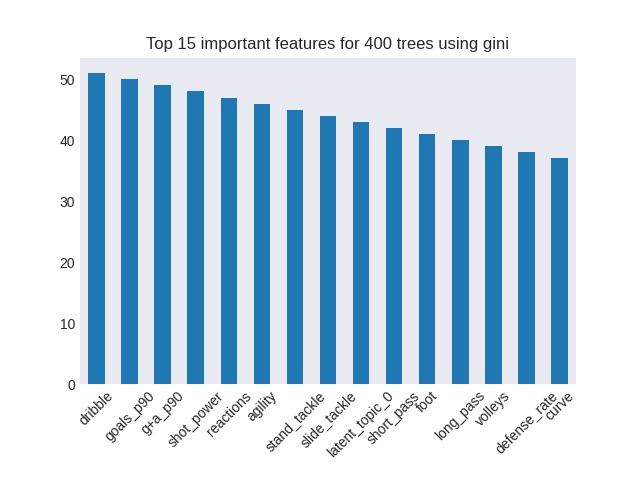

# Predicting Player Potential

  

## Table of Contents

  1. [Overview](#Overview)
  2. [Questions and Goals](#Question-and-Goals)
  3. [Exploratory Data Analysis](#Exploratory-Data-Analysis)
  4. [Visualization](#Visualization)
  5. [Conclusion](#Conclusion)
  6. [Credits](#Credits)
  7. [Future Actions](#Future)

## Overview - Can we predict if a young player will be worthy of a transfer investment using retired player stats?

In the world of professional football, finding the right players for the right money is vitally important to every team. Instead of drafting and trading players, footballers are bought and sold by their teams. And with the large injection of TV money, footballer transfer value inflation has gone through the roof. A team that wants to obtain a player under contract from another team has to agree a price with the other team to purchase the player and agree an annual salary and contract length with the player.  For example, Arsenal's transfer record is 72,000,000 pounds paid to Lille for Nicolas Pepe.  Their record contract is 350,000 pounds per week, over 4 years, given to Mesut Ozil.  These massive outlays can make or break teams, so finding the correct player is imperative.  If a team can find a young, inexpensive player that they can develop into a world-class star, they are ahead of the curve. 

I found a Kaggle sqlite database (https://www.kaggle.com/hugomathien/soccer/data) that has 10,000 players and their attributes. The database is comprised of several tables, most of which are related to historical gambling predictions. The keys to the columns in other tables is included in the [cap2_notes.txt](https://github.com/joshaldous/predicting_player_potential/cap2_notes.txt) file for informational purposes. The players table has information for birthday, height, and weight.  The player_attribute table has infomation for EA Sports FIFA ratings.  FIFA is a popular football video game where each player is given a rating for attributes such as shooting, volleying, slide tackling, goalkeeper positioning, sprint speed, acceleration, etc on a scale from 1 to 100.  This is not ideal however because FIFA attribute ratings are notoriously debatable and reems of paper and countless YouTube and Instragram hours have been used up arguing these numbers. That said, it is about as good of an approximation available without having access to direct team-coaching data. 

The great thing about this Kaggle data is that it has multiple years for the players.  This shows the development of the players (especially older players) along their career arc.  With this in mind, the plan has been to combine the Kaggle data for each player with their annual playing stats. Things like goals, assists, minutes played, yellow cards per year.  This data is very specific and not available in any one dataset so i had to scrape it individually for each player. Luckily, there is a fantastic website for all your sporting needs. [Sports-Reference.com](https://www.sports-reference.com) has stats for all major sports including football [FBRef.com](https://www.fbref.com), the [NFL](https://www.Pro-Football-Reference.com) and [College Basketball](https://www.sports-reference.com/cbb/). <!---->FBref.<!---->com has year to year stats for nearly 200,000 footballers ranging from the super-talented and famous to the most obscure.  A good deal of the past week was spent learning how to scrape the table that I wanted from FBref for each player and aggregating it into a single dataframe.  

## Questions and Goals

Given all of the above, the question must be asked.  How can teams get ahead?  Is it possible to find a combination of statistics that would allow a team to get an insight into player potential? If it is possible, what are the metrics by which a team should judge a player?  

The immediate and most basic goal is to see if a model can be built to predict if a player is worthy of a transfer investment for a certain position. Beyond that, it would be ideal to create a model could take any position into account, possibly even predict the best positions for players that don't have an obvious position. 

## Exploratory Data Analysis  
I found a great resource on [Kaggle](https://www.kaggle.com/hugomathien/soccer/data) from a user named hugomathien. This sqlite database contains over 10,000 player stats and attributes that allowed me to find out players current age.  It also contained the FIFA ratings for 40 footballing attributes. This database is really nice and well put together.  All I had to do was to load in the sqlite data into a jupyter notebook and merge the tables containing the data I needed. Since this database allowed me to see the attributes over several years of a players career, I wanted to match up the actual statistics for each player for that given year.  Stats like goals, goals per 90 minutes, minutes played, and so forth. I looked all over the internet for a dataset that might provide me with this information, but it came down to football reference and scraping the data.

In order to get the names that I needed, I made a list of all the names in kaggle database, and scraped the fbreference player search pages to find the location of that player's stat page. With all the pages needed, it was a matter of scraping the correct table from each player. This is not as straightforward as it might sound, because not all the tables with the information I was looking for are the same size, and scraping 10,000 pages takes a bit of time. In the end, my lack of experience in scraping caused me to lose quite a few players from the list. This is unfortunate, and given more time, I feel I would have rectified the issue and pull all the data I was trying to obtain. The code I used to scrape the data can be found [here](https://github.com/joshaldous/predicting_player_potential/tree/master/src/final_scrape.py). 

From there, the data-cleaning was not too complicated. It was cleaning strings, formatting dates and figuring out what to do with nans. Different nans are different beasts, and so have to be dealt with in specific ways. Once the data was clean, I ran into a major issue. I could not figure out how to create the targets I was looking for. Originally, trying to create a model to predict player potential (a FIFA attribute in the kaggle dataset) was considered, but this was deemed to reliant on the FIFA attributes given and the FIFA methodology. So I opted for a Invest/Don't Invest (simple binary target) for the position databases that I created.  I am aware that this decision also comes with its own drawbacks and questions, but it seemed the best route for the time allotment. However, because of that time constraint, I only got through one position, forwards. I spent a lot of time trying to figure out a way to get the code to figure it out automatically, but I couldn't get it right.  This is I could look at in the future, but it may not be possible.  There are so many variables and the target is very specific. 

In the end I had to manually create a list of the 'quality' forwards that had very good careers. I did this by going through the names, verifying their career stats and voting yes/no on individual players. This would not be tenable for further positions or larger datasets. The code I used to clean my data can be found [here](https://github.com/joshaldous/predicting_player_potential/tree/master/src/final_eda.py).

## Visualization

The initial data kaggle data looks like the following:

  

I dumped the scraped data into a csv and it turned out pretty well, except for the missing players. After the EDA and merging the dataframes on player names and individual years, I went about creating a model. The idea behind the project is similar to forecasting, but instead of trying to predict one long trend, the model would need to analyze trends in many different shorter time lines, and have a classification algorithm as the final output. I decided to go with unsupervised clustering to analyze the trends.  Specifically, soft clustering, because with a category like 'forwards', there are several different types of forwards. There are strikers, wingers, attacking midfielders, some play with a striking partner, and some are up top alone.  So hard clustering does not feel appropriate.  

I started with KMeans.  I wanted to try to get an idea of how many centroids to look for so I plotted the silhouette scores for my dataset:

  

This did not give me an indication of the correct number of cluster to use in my algorithm, so I decided to switch algorithms and try using sklearn's Non-negative matrix factorization (NMF). In NMF there is a similar plot to the silhouette score called the NMF reconstruction error.  Plotting the reconstruction error yielded me with the following results:

  

The idea behind the reconstruction plot is similar to a silhouette score, except you want to find the 'knee' of the graph. This is the area where the error stops gradually descending and starts to slope toward zero more sharply. The plot from my results does the opposite.  I starts with a sharper error decline and levels out to a more gradual decline around the k=3 point.  Given this, I decided to use k=3 to begin looking into the latent topics NMF would find.

My data created an inbalanced dataset where about only ~16% of the datapoints would be categorized as a 'Yes' target. The target was created as a binary 1/0 where 0 = 'no' and 1 = 'yes'. To compensate for this I used stratification of my y-values in the train-test-split. The X_train set and the X_test set run through the NMF algorithm with k=3 to yield 3 latent topics. After consulting with our instructional team, I decided the latent topics that NMF discovered would be appended to the X_train and X_test sets as an addition feature. This left me with datasets of 53 features.

Worried about the amount of features in the data, I decided to use a random forest classifier to try to predict my classifications. To get a good starting point for hyperparameter inputs, I decided to run a Randomized Search CV.  This yielded me with the following best parameters:  

    {'bootstrap': False,
    'ccp_alpha': 0.0,
    'class_weight': None,
    'criterion': 'gini',
    'max_depth': 20,
    'max_features': 'sqrt',
    'max_leaf_nodes': None,
    'max_samples': None,
    'min_impurity_decrease': 0.0,
    'min_impurity_split': None,
    'min_samples_leaf': 1,
    'min_samples_split': 2,
    'min_weight_fraction_leaf': 0.0,
    'n_estimators': 400,
    'n_jobs': None,
    'oob_score': False,
    'random_state': None,
    'verbose': 0,
    'warm_start': False}
    
Not 100% convinced by the Randomized Search CV results, I decided to run 2 sklearn RandomForestClassifiers in parallel to get more than one opinion and to judge the best model to create. One random forest was run using the Randomized Search CV hyperparameters, tuning the threshold for the predict_proba to try to determine the best outcome, and the second random forest ran with less trees and entropy as the the criterion.  The predict_proba threshold of the second forest was kept inline with the first forest through all the tests.

The worst model results came from the higher thresholds (0.7 as the threshold):

    Random_Forest_250_trees_entropy:
        Accuracy Score: 0.967
        F1 Score: 0.895
    Optimized_Random_Forest_400_trees_gini:
        Accuracy Score: 0.977
        F1 Score: 0.984

The best model results came from the 0.35 as the threshold:

    Random_Forest_250_trees_entropy:
        Accuracy Score: 0.992
        F1 Score: 0.977
    Optimized_Random_Forest_400_trees_gini:
        Accuracy Score: 0.977
        F1 Score: 0.862

The features that were the 15 most important features for the model with the best F1 score were:

  

I Also ran the model with 'fake' results where the prediction were all zeros to make sure that the model was not just predicting zero for all the targets and the scores were high because of that fact. This was disproven as shown by the drop in accuracy scores for both forests:

    Random_Forest_250_trees_entropy:
        Accuracy Score: 0.836
    Optimized_Random_Forest_400_trees_gini:
        Accuracy Score: 0.836
    

## Credits

  1. I do not own, nor pretend to own any data or images in the above presentation.  
  2. Data for the analysis was obtained from https://www.kaggle.com/hugomathien/soccer/data and https://fbref.com

## In the Future

If I continue to pursue this project, I hope to accomplish the following:
  1. Find a way to automate target allocation
  2. More precisely reduce the number of features
  3. Use more specific postions
  4. Try other Unsupervised Models as inputs to the supervised final model
  5. Try other Supervised Models as the final model
  6. Expand the predictions to other positions

